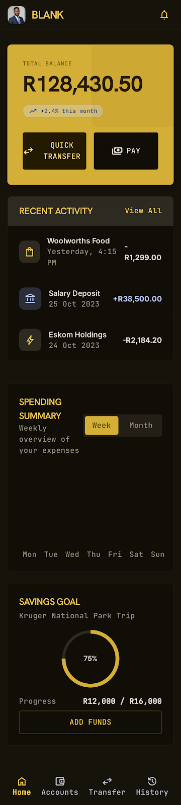
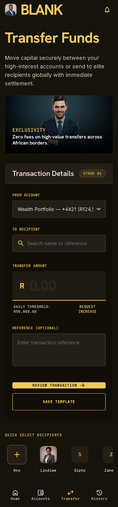
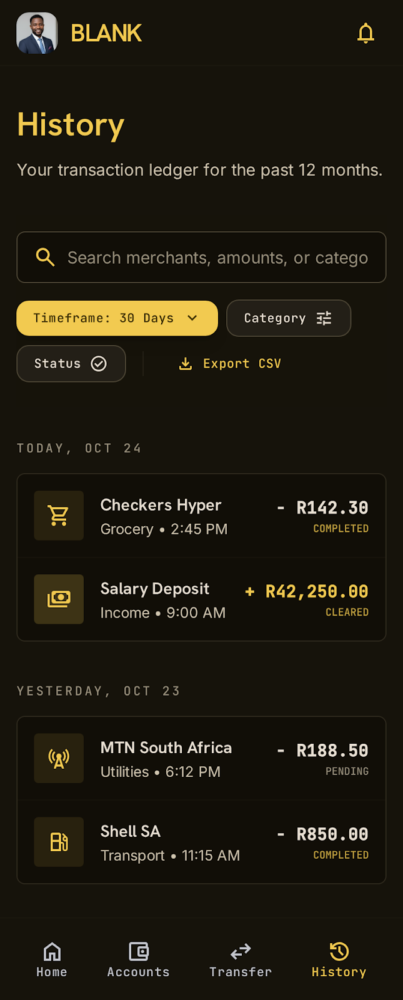

# BankingApp (Python Ledger Prototype)

A simple, robust Python banking ledger prototype that uses SQLite for local data storage and offers a command-line interface for managing accounts and transfers.

## Design
The project features a mobile-first UI design. You can find the detailed design specifications in [docs/design.md](docs/design.md).

### Mobile UI Preview
| Dashboard | Transfer | History |
| :---: | :---: | :---: |
|  |  |  |

## Features
- **Atomic Transfers**: Ensures money is never lost during transfers using database transactions.
- **Account Management**: Supports user creation, account setup, and deletion.
- **CLI Interface**: Perform banking operations directly from your terminal.

## Setup
1. **Clone the repository.**
2. **Set up virtual environment**:
   ```bash
   python -m venv venv
   # Activate: venv\Scripts\activate
   pip install -r requirements.txt
   ```
3. **Initialize the database**:
   ```bash
   python init_db.py
   ```

## Usage
- **Check Balance**: `python app.py balance --acc <account_id>`
- **Transfer Funds**: `python app.py transfer --from <id> --to <id> --amount <amount>`
- **View History**: `python app.py history --acc <account_id>`
